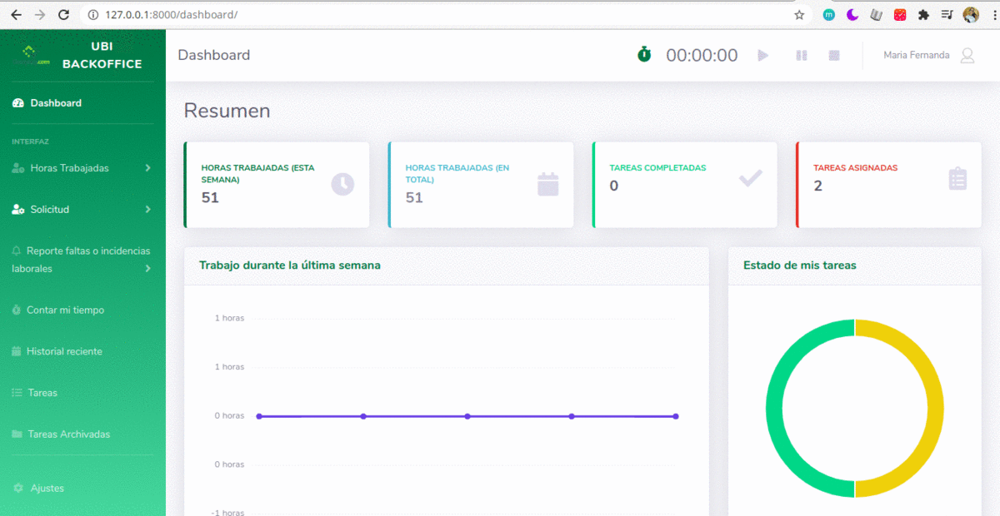

# :green_heart: Backoffice :rocket: 

Web application for the management of hours and tasks you work on human talent within a company.



## Requeriment
Python 3

## Steps to install and use

1. Create a virtual enviroment

`python3 -m venv backoffice-env`

2. Activate
    - Windows

    `backoffice-env\Script\activate.bat`

    - Unix/macOS

    `source backoffice-env/bin/activate`

3. Clone repo or download

4. Enter and install dependencies
```
cd backoffice
cd ubicutus_backoffice

pip install -r requeriments.txt

python3 manage.py migrate
python3 manage.py runserver
```

5. Enter: http://127.0.0.1:8000/

6. Create an account and enter with same user

```
email: name@ubicutus.com
password: name123456
```

7. Then you can use the app

    If you want to try the counter:
    "Horas Trabajadas" > "Registrar Tarea"
    And then enter in the link:
    http://127.0.0.1:8000/contador/
    Select the task in the dropdown menu and click: "Asignar Hora"
    And then you can use the counter.